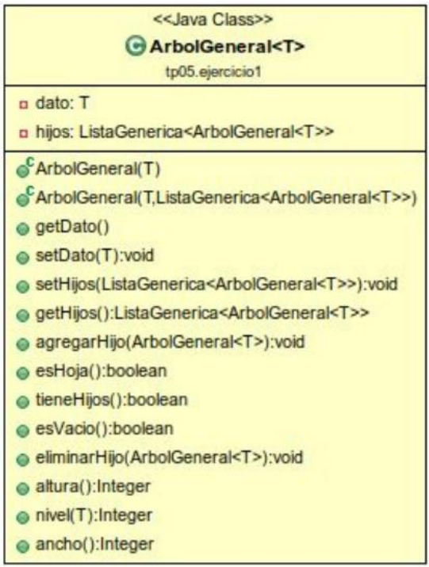

<h1 align="center">Practica 4</h1>

### Importante:

Se recomienda continuar trabajando dentro del proyecto AyED y generar paquetes y subpaquetes para esta práctica.

Descargue el archivo **tp04_ag.zip** El archivo zip descargado desde la página de la cátedra no es un proyecto eclipse, por lo tanto:

‎ ‎ ‎ ‎ ‎ ‎ ‎ ‎ `1.` Descomprima el archivo zip.

‎ ‎ ‎ ‎ ‎ ‎ ‎ ‎ `2.` Sobre la carpeta src de su proyecto AyED haga click con el botón derecho del mouse y seleccione la opción Import > FileSystem.

‎ ‎ ‎ ‎ ‎ ‎ ‎ ‎ `3.` Haga click en “Browse”, busque la carpeta descomprimida y seleccione la carpeta tp04_ag (haga click para que aparezca el check seleccionado). 

‎ ‎ ‎ ‎ ‎ ‎ ‎ ‎ `4.` Haga click en el botón finalizar.

<div align = "center"  id="Ejercicio_1"> 
  
<h2 align="center"> Indice: </h2>

| [1](#Ejercicio_1) | [2](#Ejercicio_2) | [3](#Ejercicio_3) | [4](#Ejercicio_4) | [5](#Ejercicio_5) | [6](#Ejercicio_6) | [7](#Ejercicio_7) |
===

</div>

### Ejercicio 1

Considere la siguiente especificación de la clase **ArbolGeneral** (con la representación de **Lista de Hijos**)


<div align="center"> 


 ```
 NOTA: La clase Lista es la utilizada en la práctica 2.
 ```

 </div>

<br>

El constructor ***ArbolGeneral(T dato)*** inicializa un árbol que tiene como raíz un nodo general. Este nodo tiene el dato pasado como parámetro y una lista vacía.

El constructor ***ArbolGeneral(T dato, ListaGenerica<ArbolGeneral<T>> hijos)*** inicializa un árbol que tiene como raíz un nodo general. Este nodo tiene el dato pasado como parámetro y tiene como hijos la lista pasada como parámetro.

El método ***getDato():T*** retorna el dato almacenado en la raíz del árbol.

El método ***getHijos():ListaGenerica<ArbolGeneral<T>>***, retorna la lista de hijos de la raíz del árbol.

El método ***agregarHijo(ArbolGeneral<T> unHijo)*** agrega unHijo a la lista de hijos del árbol

El método ***eliminarHijo(ArbolGeneral<T> unHijo)*** elimina unHijo del árbol.

El método ***tieneHIjos()*** devuelve verdadero si la lista de hijos del árbol no es null y tampoco es vacía 

El método ***esVacio()*** devuelve verdadero si el dato del árbol es null y además no tiene hijos.

Los métodos ***altura(), nivel(T) y ancho()*** se resolverán en el ejercicio 4. 

Analice la implementación en JAVA de las clases ***ArbolGeneral*** brindadas por la cátedra

<br><hr id="Ejercicio_2"><br>
 
### Ejercicio 2

‎ ‎ ‎ ‎ ‎ ‎ ‎ ‎ `a)` ¿Qué recorridos conoce para recorrer en profundidad un árbol general? Explique brevemente.

<details>

<summary>‎ ‎ ▶️</summary>
<br>

</details>

‎ ‎ ‎ ‎ ‎ ‎ ‎ ‎ `b)` ¿Qué recorridos conoce para recorrer por niveles un árbol general? Explique brevemente.


<details>
<summary>‎ ‎ ▶️</summary>
<br>

</details>

‎ ‎ ‎ ‎ ‎ ‎ ‎ ‎ `c)` ¿Existe alguna diferencia entre los recorridos preorden, postorden, inorden para recorrer los árboles generales respecto de los árboles binarios? Justifique su respuesta.

<details>

<summary>‎ ‎ ▶️</summary>
<br>

</details>

‎ ‎ ‎ ‎ ‎ ‎ ‎ ‎ `d)` ¿Existe alguna noción de orden entre los elementos de un árbol general? Justifique su respuesta.

<details>
<summary>‎ ‎ ▶️</summary>
<br>

 </details>

‎ ‎ ‎ ‎ ‎ ‎ ‎ ‎ `e)` En un árbol general se define el ***grado de un nodo*** como el número de hijos de ese nodo y el ***grado del árbol*** como el máximo de los grados de los nodos del árbol. ¿Qué relación encuentra entre los Árboles Binarios sin tener en cuenta la implementación? Justifique su respuesta

<details>
<summary>‎ ‎ ▶️</summary>
<br>

</details>

<br><hr id="Ejercicio_3"><br>
 
### Ejercicio 3

‎ ‎ ‎ ‎ ‎ ‎ ‎ ‎ `a)` Implemente en la clase ***RecorridosAG*** los siguientes métodos:

 <br>
 
```Java
public ListaGenerica<Integer> numerosImparesMayoresQuePreOrden (ArbolGeneral <Integer> a, Integer n) {
  }
```

Método que retorna una lista con los elementos impares del árbol “a” que sean mayores al valor “n” pasados como parámetros, recorrido en preorden.

<details>

<summary>▶️</summary>
<br>

```Java
public ListaGenerica<Integer> numerosImparesMayoresQuePreOrden (ArbolGeneral<Integer> a, Integer n) {
  ListaEnlazadaGenerica<Integer> Lista = new ListaEnlazadaGenerica<>();
  numerosImparesMayoresQuePreOrden(Lista, a, n);
  return Lista;
}


private void numerosImparesMayoresQuePreOrden (ListaGenerica<Integer> Lista, ArbolGeneral<Integer> a, Integer n) {

  if ((a.getDato() % 2 == 1) & (a.getDato() > n)) {
    Lista.agregarFinal(a.getDato());
  }

  if (a.tieneHijos()) {
    ListaGenerica<ArbolGeneral<Integer>> listaHijos = a.getHijos();
    listaHijos.comenzar();
    while (!listaHijos.fin()) {
      numerosImparesMayoresQuePreOrden(Lista, listaHijos.proximo(), n);
    }
  }
}
```

</details>
<br>

```Java
public ListaGenerica<Integer> numerosImparesMayoresQueInOrden (ArbolGeneral <Integer> a, Integer n) {
  }
```

Método que retorna una lista con los elementos impares del árbol “a” que sean mayores al valor “n” pasados como parámetros, recorrido en inorden.

<details>

<summary>▶️</summary>
<br>

```Java
public ListaGenerica<Integer> numerosImparesMayoresQueInOrden (ArbolGeneral <Integer> a, Integer n) {
  ListaEnlazadaGenerica<Integer> Lista = new ListaEnlazadaGenerica<>();
  numerosImparesMayoresQueInOrden(Lista, a, n);
  return Lista;
}


private void numerosImparesMayoresQueInOrden (ListaGenerica<Integer> Lista, ArbolGeneral <Integer> a, Integer n) {

  if (a.tieneHijos()) {
    ListaGenerica<ArbolGeneral<Integer>> listaHijos = a.getHijos();
    listaHijos.comenzar();
    numerosImparesMayoresQueInOrden(Lista, listaHijos.proximo(), n);
  }

  if ((a.getDato() % 2 == 1) & (a.getDato() > n)) {
    Lista.agregarFinal(a.getDato());
  }

  if (a.tieneHijos()) {
    ListaGenerica<ArbolGeneral<Integer>> listaHijos = a.getHijos();
    listaHijos.comenzar();
    listaHijos.proximo();
    while (!listaHijos.fin()) {
      numerosImparesMayoresQueInOrden(Lista, listaHijos.proximo(), n);
    }
  }
}
```

</details>
<br>

```Java
public ListaGenerica< Integer > numerosImparesMayoresQuePostOrden (ArbolGeneral <Integer> a, Integer n) {
  }
```

Método que retorna una lista con los elementos impares del árbol “a” que sean mayores al valor “n” pasados como parámetros recorrido en postorden.

<details>

<summary>▶️</summary>
<br>

```Java
public ListaGenerica<Integer> numerosImparesMayoresQuePostOrden (ArbolGeneral<Integer> a, Integer n) {
  ListaEnlazadaGenerica<Integer> Lista = new ListaEnlazadaGenerica<>();
  numerosImparesMayoresQuePostOrden(Lista, a, n);
  return Lista;
}

  
private void numerosImparesMayoresQuePostOrden (ListaGenerica<Integer> Lista, ArbolGeneral<Integer> a, Integer n) {

  if (a.tieneHijos()) {
    ListaGenerica<ArbolGeneral<Integer>> listaHijos = a.getHijos();
    listaHijos.comenzar();
    while (!listaHijos.fin()) {
      numerosImparesMayoresQuePostOrden(Lista, listaHijos.proximo(), n);
    }
  }

  if ((a.getDato() % 2 == 1) & (a.getDato() > n)) {
    Lista.agregarFinal(a.getDato());
  }
}
```

</details>
<br>

```Java
public ListaGenerica< Integer > numerosImparesMayoresQuePorNiveles(ArbolGeneral <Integer> a, Integer n) {
  }
```

Método que retorna una lista con los elementos impares del árbol “a” que sean mayores al valor “n” pasados como parámetros, recorrido por niveles.

<details>

<summary>▶️</summary>
<br>

```Java
public ListaGenerica<Integer> numerosImparesMayoresQuePorNiveles(ArbolGeneral <Integer> a, Integer n) {
  ColaGenerica<ArbolGeneral<Integer>> cola = new ColaGenerica<>();
  ArbolGeneral<Integer> aux;
  ListaGenerica<ArbolGeneral<Integer>> hijos;
  ListaEnlazadaGenerica<Integer> Lista = new ListaEnlazadaGenerica<>();

  cola.encolar(a);

  while (!cola.esVacia()) {
    aux = cola.desencolar();

    if ((aux.getDato() % 2 == 1) & (aux.getDato() > n)) {
      Lista.agregarFinal(aux.getDato());
    }

    if (aux.tieneHijos()) {
      hijos = aux.getHijos();
      hijos.comenzar();
      while (!hijos.fin()) {
        cola.encolar(hijos.proximo());
      }
    }
  }

  return Lista;
}
```

</details>

‎ ‎ ‎ ‎ ‎ ‎ ‎ ‎ `b)`  Si ahora tuviera que implementar estos métodos en la clase ArbolGeneral <T>, que modificaciones haría tanto en la firma como en la implementación de los mismos? 
  
<br><hr id="Ejercicio_4"><br>
 
### Ejercicio 4

Implemente en la clase `ArbolGeneral` los siguientes métodos

- `a)` **public int altura(): int** devuelve la altura del árbol, es decir, la longitud del camino más largo desde el nodo raíz hasta una hoja.

<details>

<summary>▶️</summary>
<br>

```Java
public Integer altura() {
  ColaGenerica<ArbolGeneral<T>> cola = new ColaGenerica();
  ArbolGeneral<T> aux;
  ListaGenerica<ArbolGeneral<T>> hijos;
  Integer altura = 0;

  cola.encolar(this);
  cola.encolar(null);

  while (!cola.esVacia()) {
    aux = cola.desencolar();
    if (aux == null) {            // Si llegue a la final de un nivel,
      if (!cola.esVacia()) {      // y quedan datos en la cola,
        altura++;                 // aumento el nivel,
        cola.encolar(null);       // y marco otro cambio de nivel
      }
    } else if (aux.tieneHijos()) {
      hijos = aux.getHijos();
      hijos.comenzar();
      while (!hijos.fin()) {
        cola.encolar(hijos.proximo());
      }
    }
  }

  return altura;
}
```

</details>

- `b)` **public int nivel(T dato)** devuelve la profundidad o nivel del dato en el árbol. El nivel de un nodo es la longitud del único camino de la raíz al nodo.

<details>

<summary>▶️</summary>
<br>

```Java
public Integer nivel(T dato) {
  ColaGenerica<ArbolGeneral<T>> cola = new ColaGenerica<>();
  ArbolGeneral<T> aux = this;
  ListaGenerica<ArbolGeneral<T>> hijos;
  Integer nivel = 0;

  cola.encolar(this);
  cola.encolar(null);

  while (!cola.esVacia()) {
    aux = cola.desencolar();
    if (aux == null) {
      if (!cola.esVacia()) {        // Si saque un null y quedan datos,
        nivel++;                    // sumo el nivel,
        cola.encolar(null);         // agrego otro null para marcar un cambio de nivel.
      }	
    } else {
      if (aux.getDato() == dato) {  // Si encontre el dato,
        return nivel;               // devuelvo el valor actual de nivel.
      }
      if (aux.tieneHijos()) {       // Si no lo encontre,
        hijos = aux.getHijos();     // sigo buscando en los hijos.
        hijos.comenzar();
        while (!hijos.fin()) {
          cola.encolar(hijos.proximo());
        }
      }
    }
  }
  return -1;		// Si llegue a este punto quiere decir que no encotro el dato, entonces devuelve -1
}
```

</details>

- `c)` **public int ancho(): int** la amplitud (ancho) de un árbol se define como la cantidad de nodos que se encuentran en el nivel que posee la mayor cantidad de nodos.

<details>

<summary>▶️</summary>
<br>

```Java
public Integer ancho() {
  ColaGenerica<ArbolGeneral<T>> cola = new ColaGenerica<>();
  ArbolGeneral<T> aux;
  ListaGenerica<ArbolGeneral<T>> hijos;
  Integer ancho = 0, max = -1;

  cola.encolar(this);
  cola.encolar(null);

  while (!cola.esVacia()) {
    aux = cola.desencolar();
    if (aux != null) {                  // Si saque un dato,
      ancho++;                          // aumento el ancho del nivel actual
      if (aux.tieneHijos()) {
        hijos = aux.getHijos();         // Meto hijos a la cola*
        hijos.comenzar();
        while (!hijos.fin()) {
          cola.encolar(hijos.proximo());
        }
      }
    } else {                            // Si saque un null hago 3 cosas:
      if (!cola.esVacia()) {            // 1.  Si quedan datos,
        cola.encolar(null);             //	agrego otro null para marcar un cambio de nivel.
      }

      if (ancho > max) {                // 2.  Comparo la cantidad de datos del nivel que
        max = ancho;                    // 	acabo de leer, si es mayor a max, actualizo.
      }
      ancho = 0;                        // 3.  Reseteo el ancho para el nuevo nivel
    }
  }

  return max;
}
```

</details>

<br><hr id="Ejercicio_5"><br>
 
### Ejercicio 5

El esquema de comunicación de una empresa está organizado en una estructura jerárquica, en donde cada nodo envía el mensaje a sus descendientes. Cada nodo posee el tiempo que tarda en transmitir el mensaje. 

<div align="center"> 


 </div>

Se debe devolver el ***mayor promedio*** entre todos los valores promedios de los niveles.

Para el ejemplo presentado, el promedio del nivel 0 es 14, el del nivel 1 es 16 y el del nivel 2 es 10. Por lo tanto, debe devolver 16.

- `a)` Indique y justifique qué tipo de recorrido utilizará para resolver el problema.
- `b)` Implementar en una clase AnalizadorArbol, el método con la siguiente firma:

***public int devolverMaximoPromedio (ArbolGeneral<AreaEmpresa>arbol)***

Donde ***AreaEmpresa*** es una clase que representa a un área de la empresa mencionada y que contiene la identificación de la misma representada con un ***String*** y una tardanza de transmisión de mensajes interna representada con ***int***.

<details>

<summary>▶️</summary>
<br>

```Java

```

</details>

<br><hr id="Ejercicio_6"><br>
 
### Ejercicio 6

Se dice que un nodo n es ancestro de un nodo m si existe un camino desde n a m.
 
Se dice que un nodo n es descendiente de un nodo m si existe un camino desde m a n.
 
Implemente un método en la clase ArbolGeneral con la siguiente firma:

<br>
 
***public Boolean esAncestro(T a, T b):*** devuelve true si el valor a es ancestro del valor b.

<br>
 
El cual determine si un valor a es ancestro de un valor b. 

<details>

<summary>▶️</summary>
<br>

```Java

```

</details>

<br><hr id="Ejercicio_7"><br>
 
### Ejercicio 7 

Sea una red de agua potable, la cual comienza en un caño maestro y la misma se va dividiendo sucesivamente hasta llegar a cada una de las casas.
 
Por el caño maestro ingresan “x” cantidad de litros y en la medida que el caño se divide, de acuerdo con las bifurcaciones que pueda tener, el caudal se divide en partes iguales en cada una de ellas. Es decir, si un caño maestro recibe 1000 litros y tiene por ejemplo 4 bifurcaciones se divide en 4 partes iguales, donde cada división tendrá un caudal de 250 litros.
 
Luego, si una de esas divisiones se vuelve a dividir, por ej. en 5 partes, cada una tendrá un caudal de 50 litros y así sucesivamente hasta llegar un lugar sin bifurcaciones.

Se debe implementar una clase ***RedDeAguaPotable*** que contenga el método con la siguiente firma:

***public double minimoCaudal(double caudal)***

que calcule el caudal de cada nodo y determine cuál es el mínimo caudal que recibe una casa. Asuma que la estructura de caños de la red está representada por una variable de instancia de la clase RedAguaPotable y que es un ArbolGeneral.

Extendiendo el ejemplo en el siguiente gráfico, al llamar al método minimoCaudal con un valor de 1000.0
debería retornar 25.0

<div align="center"> 


 </div>

<details>

<summary>▶️</summary>
<br>

```Java

```

</details>
